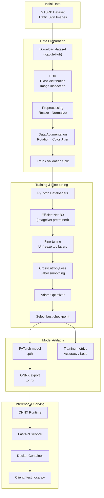

# Traffic Sign Prediction (GTSRB)
**EfficientNet-B0 | PyTorch | ONNX | FastAPI | Docker**


This project is an end-to-end **traffic sign image classification system** built on the **German Traffic Sign Recognition Benchmark (GTSRB)** dataset.

It covers the full machine learning lifecycle:
- Exploratory Data Analysis (EDA)
- Model training with transfer learning
- Evaluation
- ONNX export
- Deployment via a lightweight FastAPI service

---

## Problem

Traffic signs are critical for safe driving and autonomous systems.  
Incorrect or missed recognition can lead to unsafe decisions.

Real-world traffic sign images suffer from:
- Motion blur
- Different lighting conditions
- Occlusions
- Varying scales and rotations

The challenge is to **accurately classify traffic signs from images** into one of **43 official German traffic sign categories**.

---

## Objective

The goal of this project is to build a **robust image classification model** that:
- Takes a traffic sign image as input
- Predicts the most likely traffic sign class
- Returns top-k predictions with probabilities
- Can be served via a production-ready API

---

## Why This Matters

- Core component for **ADAS and autonomous driving**
- Useful for **traffic monitoring systems**
- Demonstrates real-world **computer vision deployment**
- Bridges research → production (PyTorch → ONNX → API)

---

## Dataset

**German Traffic Sign Recognition Benchmark (GTSRB)**

- 43 traffic sign classes
- ~50,000 images
- Varying resolutions and lighting conditions
- Public benchmark dataset

Dataset is downloaded and prepared using **KaggleHub**.

---
## End-to-End Machine Learning Pipeline


## Exploratory Data Analysis

- Dataset is **class-imbalanced**
- Some signs appear 10× more frequently than others
- Images have varying resolutions
- Significant intra-class variability
- Strong visual similarity between some classes (e.g., speed limits)

EDA results motivated:
- Data augmentation
- Transfer learning
- Label smoothing during training

---

## Model Selection

### Architecture
- **EfficientNet-B0**
- Pretrained on ImageNet
- Custom classification head (43 classes)

### Why EfficientNet?

- Excellent accuracy–parameter tradeoff
- Strong performance on small-to-medium datasets
- Well-suited for mobile and edge deployment
- Widely supported in ONNX

---

## Training Strategy

- **Transfer learning**
  - Backbone frozen initially
  - Later layers unfrozen for fine-tuning
- **Loss Function**
  ```python
  nn.CrossEntropyLoss(label_smoothing=0.1)
- **Optimizer**: Adam

- **Input Size**: 224 × 224

- **Normalization**: ImageNet mean & std

## Why Label Smoothing?

- Prevents overconfidence

- Improves generalization

- Handles ambiguous and noisy labels

- Especially useful for visually similar classes

## Evaluation Metrics

- Accuracy

- Validation loss

## Project Structure

```
Traffic-Sign-CNN-Pytorch/
|
├── manifests/ # Kubernetes
│ ├── deployment.yaml
│ └── service.yaml
|
├── model/ # Trained & exported models
│ ├── efficientnet_b0_20_0.849.pth
│ ├── traffic_sign_efficientnet_b0.onnx
│ └── traffic_sign_efficientnet_b0.onnx.data
│
├── notebook/
│ └── traffic_sign.ipynb # Training & experimentation notebook
│
├── src/
│ ├── app.py # FastAPI inference server (ONNX Runtime)
| ├── test_local.py # Client script for testing predictions
│ └── train.py # Script to train the  model
│
├── test-images/ # Sample images for testing
│ ├── sign1.png
│ ├── sign2.png
│ └── sign3.jpg
│
├── assets/
├── Dockerfile # Docker image definition
├── pyproject.toml # Python dependencies
├── uv.lock # Locked dependency versions
├── .python-version # Python version
└── README.md # Project documentation
```

## Performance Metrics

Validation Accuracy: 84.9% on the validation set

Model Size: 15.39 MB (ONNX format)

Input Resolution: 224 × 224 pixels (automatically resized)

## Notebook

```📓 notebook/traffic_sign.ipynb```

The notebook contains the entire research and training workflow:

### Notebook Contents

1. Dataset download & inspection

2. Image visualization

3. Custom PyTorch Dataset

4. Data augmentation

5. Model definition

6. Training loop

7. Hyper parameter tunning

8. Validation & metrics

9. Model checkpointing

10. ONNX export for deployment

📌 **Note**
The notebook is **not required for inference**. It is used only to train and export the model.

## Train the model

Sync the project environment and install required packages using uv
```
uv sync
uv add kagglehub torch torchvision
```

Train the Model
```
uv run src/train.py
```
📌 **Note**
The script is **not required for inference**. It is used only to train and export the model.

## 🔮 API Endpoint

```POST /predict```
* Input: Image file (multipart/form-data)

* Output: Top-K predictions with probabilities

Example response:

```
{
    'predictions': 
        {
            'Stop': 0.8890567892, 
            'Speed limit (100km/h)': 0.0215678546, 
            'Ahead only': 0.0133458735, 
            'Speed limit (30km/h)': 0.0133434535, 
            'No entry': 0.0156758735
        }, 
    'top_class': 'Stop', 
    'top_probability': 0.889056789
}
```

## Deployment
### Platform Options

- Local machine

- Docker

- AWS EC2 (Free Tier compatible)

- Kubernetes (Local with kind)


## How-To Run
### 🧪 1. Local Testing (Without Docker)

### ✅ Prerequisites
- Python 3.12+
- `uv`

### Step 1: Create virtual environment
```
uv sync
```

### Step 2: Start the API server
```
uv run python src/app.py
```
Server will run at: ```http://127.0.0.1:8080```

### Step 3: Test with sample images
```
uv run python src/test_local.py
```

## 🐳 2. Docker Testing (Recommended)

### ✅ Prerequisites

- Docker

### Step 1: Build Docker image
```
docker build --no-cache -t traffic-classifier .
```

### Step 2: Run the container
```
docker run -it --rm -p 8080:8080 traffic-classifier
```
<video controls src="assets/start-app.mp4" title="start-app" width="400"></video>

### Step 3: Verify health
```
curl http://127.0.0.1:8080/health
```
Expected response:

```
{ "status": "healthy" }
```
### Step 4: Run client test
```
uv run python src/test_local.py
```
<video controls src="assets/test-app.mp4" title="test-app" width="400"></video>

## ☁️ 3. Cloud Deployment (AWS EC2 – Free Tier)

This project can be deployed at zero cost using the AWS Free Tier. The service runs inside a Docker container on a lightweight EC2 instance and exposes a FastAPI endpoint for inference.

### Architecture

Client → EC2 (Docker) → FastAPI → ONNX Runtime → Traffic Sign Model

### Step 1: Launch an EC2 Instance

1. Go to **AWS EC2 Console**

2. Launch a new instance with:

    -   AMI: Ubuntu Server 22.04 LTS

    -   Instance type: t2.micro or t3.micro (Free Tier eligible)

3. Configure security group:

    -   Allow SSH: port 22

    -   Allow API access: port 8080

4. Create or select an SSH key pair

### Step 2: Connect to the Instance

```ssh -i <key.pem> ubuntu@<EC2_PUBLIC_IP>```

### Step 3: Install Docker
```
sudo apt update
sudo apt install -y docker.io
sudo usermod -aG docker ubuntu
```

### Step 4: Clone project & build image
```
git clone ***
cd <repo>
docker build -t traffic-classifier .
```

### Step 5: Run service
```
docker run -d -p 8080:8080 traffic-classifier
```

### Step 6: Verify deployment
```
curl http://<EC2_PUBLIC_IP>:8080/health
```


## ☸️ 4. Kubernetes Deployment (Local with kind)

### ✅ Prerequisites
- Docker
- `kubectl`
- `kind`
- Local Docker image: `traffic-classifier:latest`

### Step 1: Create a kind cluster
```
kind create cluster --name cnn
```
Verify the cluster:

```
kubectl cluster-info
kubectl get nodes
```
### Step 2: Load Docker image into kind

Local Docker images must be explicitly loaded into the kind cluster.

``` 
kind load docker-image traffic-classifier:latest --name cnn
```
Verify the image is available inside the cluster:

```
docker exec -it cnn-control-plane crictl images | grep traffic
```
### Step 3: Deploy Kubernetes manifests

Apply the Deployment and Service manifests:

```
kubectl apply -f manifests/deployment.yaml
kubectl apply -f manifests/service.yaml
```
Check resource status:

```
kubectl get pods
kubectl get svc
```
### Step 4: Port-forward the service

Expose the service locally using port forwarding:

```
kubectl port-forward service/traffic-classifier-service 30080:8080
```
The API will be accessible at:

```http://localhost:30080```
### Step 5: Verify health endpoint
```
curl http://localhost:30080/health
```

Expected response:

```
{ "status": "healthy" }
```
### Step 6: Test prediction endpoint
```
curl -X POST http://localhost:30080/predict \
  -F "file=@test-images/sign1.png"
```
### 🧹 Cleanup

Delete the kind cluster when finished:

```
kind delete cluster --name cnn
```